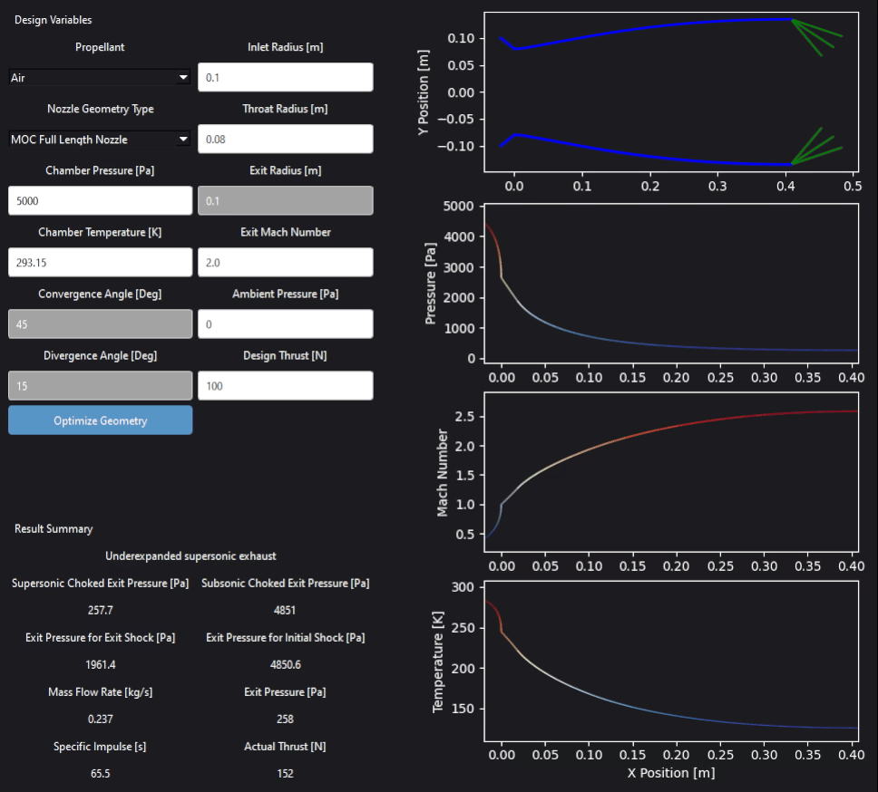
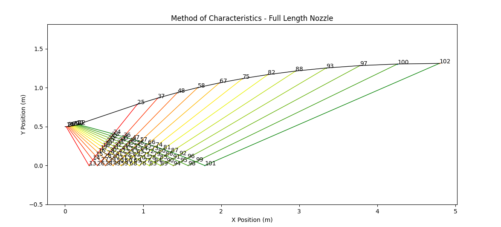

# About The Project
**Convergent-divergent Nozzle Simulator** is a Python GUI that computes thermodynamic properties for various nozzle geometries and optimizes the nozzle design to achieve ideal thrust.
<center>
    
    
</center>

## Features
- 1D, steady, adiabatic, isentropic flow solver
- Method of characteristics nozzle contour generator
- Thrust design using gradient descent algorithm with ADAM optimizer 
- Cross-platform support (Windows/macOS/Linux) PyQt6 GUI

# Table of Contents
- [Theory](#theory)
- [Getting Started](#getting-started)
- [Installation](#installation)
- [Basic Usage](#basic-usage)

## Theory
Initially the code assumes **1D steady adiabatic isentropic** flow with an ideal gas of constant specific heats. The code begins by calculating supersonic and subsonic critical exit pressures by using the area-Mach relation assuming choked flow. It then compares ambient pressure to critical pressure conditions to determine the type of flow produced.

If ambient pressure is above chamber pressure then reverse flow is produced.

If ambient pressure is above the subsonic limit, the code assumes subsonic flow throughout the entire nozzle.

If ambient pressure is less than subsonic, the code sweeps through the divergent section plotting normal shocks and calculating post-shockwave properties at each location trying to match ambient conditions.

If a nozzle at exit can not bring pressure low enough, then the nozzle is overexpanded and Prandtl-Meyer shockwaves are plotted in the exhaust plume. 

If ambient pressure is lower than supersonic exit pressure then the nozzle is underexpanded with oblique shockwaves produced in the exhaust.

Once flow type is established, the code uses isentropic relations, stagnation conditions, and area-Mach relation to generate Mach, temperature, and pressure curves at each contour point.

<center>
    
</center>

Method of characteristics is a solution method for solving partial differential equations through reduction to an ordinary differential equation. We initially begin with the continuity equation and Euler's equation derived from the inviscid assumption for Navier-Stokes equations. The velocity potential is derived from these equations and is of the form

$$\left(1 - \frac{\Phi_x^2}{a^2}\right) \Phi_{xx} + \left(1 - \frac{\Phi_y^2}{a^2}\right) \Phi_{yy}-2\,\frac{\Phi_x \Phi_y}{a^2}\, \Phi_{xy}= 0 $$

For a hyperbolic PDE, at every point A, there exists characteristic lines in which the PDE reduce to ODE compatiblity equations. The direction of these characteristic or Mach lines is given as,

$$\left(\frac{dy}{dx}_{char} = \tan{\theta \mp \mu} \right)$$

The compatibility equation for these char lines with K- and K+ representing right and left running characateristic lines respectfully are,

$$\theta + \nu(M) = const = K-$$
$$\theta - \nu(M) = const = K+$$

Starting with initially defined fluid properties, we can generate characteristic lines and solve for fluid properties at intersections by setting characteristic strengths equal to each other. For centerline points flow must flow at zero angle. Along the wall we find the intersection between an average of current and previous flow angles with the left running char line.

<figure>
    <center>
        
        <figcaption>
        Figure 3: Characteristic lines and streamline at point A. Source: ANSYS, Inc. (2020). "Lesson 6: Nozzle Tutorial Handout." ANSYS Innovation Courses. Retrieved from [https://innovationspace.ansys.com/courses/wp-content/uploads/2020/12/Lesson6-Handout-NT-v1.pdf]
        </figcaption>
    </center>
</figure>
# Getting Started

## Prerequisites
- Python 3.10+
- matplotlib 3.10.6+
- numpy 2.3.3+
- PyQt6 6.9.1+
- PyQt6_sip 13.9.1+
- scipy 1.16.1+

## Installation

1.  Clone the repository:
    ```bash
    git clone https://github.com/am975eng/Convergent-Divergent-Nozzle-Simulator.git
    cd Convergent-Divergent-Nozzle-Simulator
    ```

2.  (Optional) Create and activate a virtual environment:
    ```bash
    python -m venv test_venv
    Set-ExecutionPolicy -Scope Process -ExecutionPolicy Bypass # If first time using venv
    test_venv\Scripts\activate.ps1  # Windows
    ```

3.  Install the dependencies:
    ```bash
    pip install -r requirements.txt
    ```

4.  Run main script
    ```bash
    python main.py
    ```


## Basic Usage
### User Inputs
* All user inputs are assumed in SI units. Changing any option recalculates values instantly.

* **Air, CO2, N2, and Xenon** are available as propellants for analysis.

* **MOC full length nozzle** generates an expansion and straightening section with exit Mach number being used to map out contour.

* **MOC minimum length nozzle** generates a sharper corner at throat with expansion fans canceled out along the contour. It represents the smallest possible length for a nozzle designed by method of characteristics.

* **Conical nozzle option** is based on convergence and divergence angles with respect to throat radius and drawn to inlet and exit radii.
Options not applicable to nozzle type will be **greyed out**.

* **Chamber pressure and temperature** set stagnation conditions.

* **Ambient pressure** is used to match exit pressure and determine flow type.

* **Design Thrust** The thrust optimized for in the gradient descent algorithm. Takes into account momentum and pressure thrust.

* **Optimize** starts the gradient-descent algorithm iterating nozzle geometries until calculated thrust equals designed thrust.

### Results Summary
* Label prints out the current flow regime.

* Supersonic choked exit pressure - Assumes choked perfectly expanded supersonic flow.

* Subsonic choked exit pressure - Assumes near sonic choked throat that is compressed back to a subsonic exit.

* Exit shock exit pressure - Assumes a normal shock at the very end of the nozzle.

* Initial shock exit pressure - Assumes a normal shock at the initial portion of the divergent section.

* Mass flow rate - Rate of mass transfer through nozzle.

* Exit pressure - Actual exit pressure of the nozzle.

* Specific impulse - Measure of efficiency a nozzle generates thrust.

* Actual thrust - Thrust generated from $$F=\dot m_e V_e + (p_e-p_{amb})A_e$$

## ✉️ Contact  
Adam Matrab — [@am975eng](https://github.com/am975eng)
